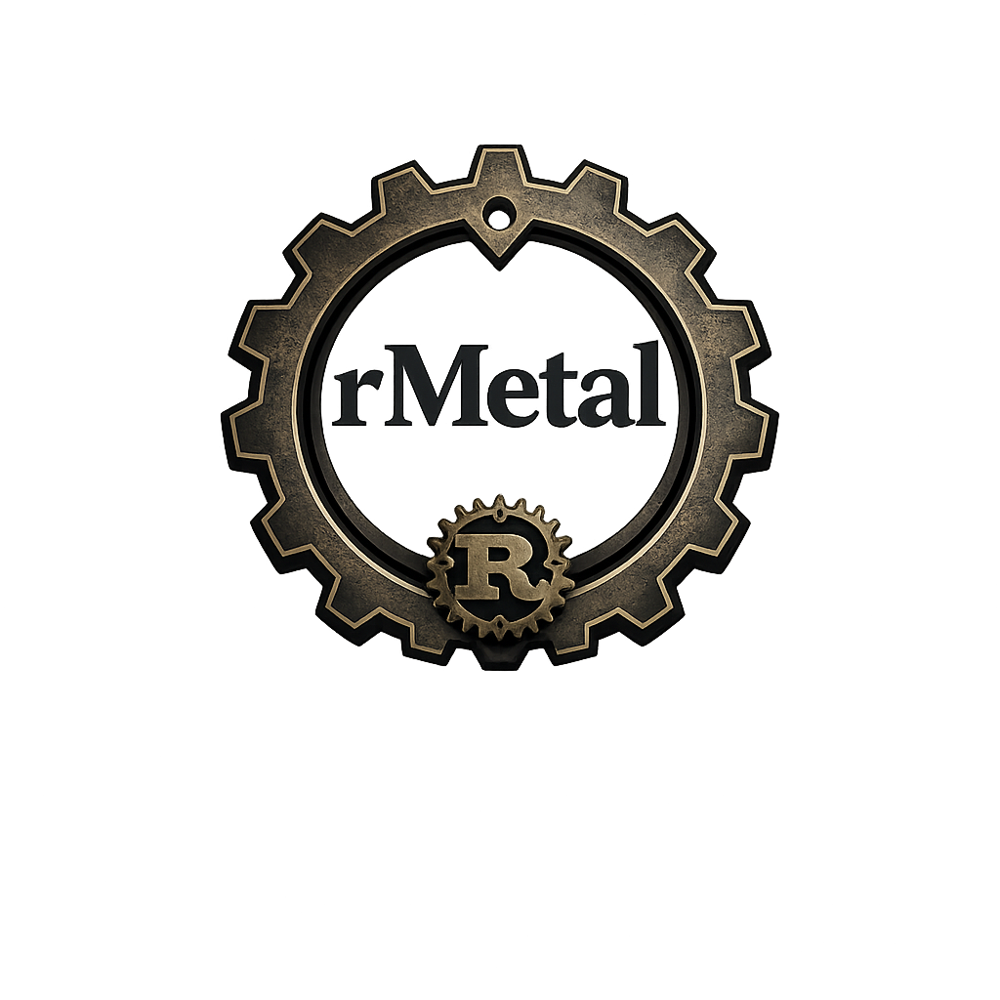

<p align="center">
  <a href="https://www.rust-lang.org/"></a>
  <a href="https://crates.io/"></a>
  <a href="https://docs.rs/"></a>
  
</p>

---

## Descripción y Motivación

`rMetal` es una biblioteca de optimización metaheurística escrita íntegramente en Rust. Su objetivo principal es proporcionar un marco de trabajo (*framework*) potente, flexible e idiomático para resolver problemas de optimización complejos, tanto de un solo objetivo (mono-objetivo) como de múltiples objetivos (multiobjetivo).

La motivación detrás de `rMetal` surge de la necesidad de aplicar la **seguridad de memoria y el alto rendimiento** de Rust al campo de la investigación operativa.

Este proyecto es el resultado de mi **TFG**, con el que termino mis estudios sobre la ingeniería del software.

---

## Instalación

`rMetal` está diseñado para ser integrado en proyectos Rust existentes. Una vez publicado en crates.io (actualmente en WIP), podrás añadirlo a tu `Cargo.toml`:

```toml
[dependencies]
rmetal = "0.1.0"
# O directamente desde git mientras está en desarrollo
# rMetal = { git = "[https://github.com/DRLKs/rMetal.git](https://github.com/DRLKs/rMetal.git)" }